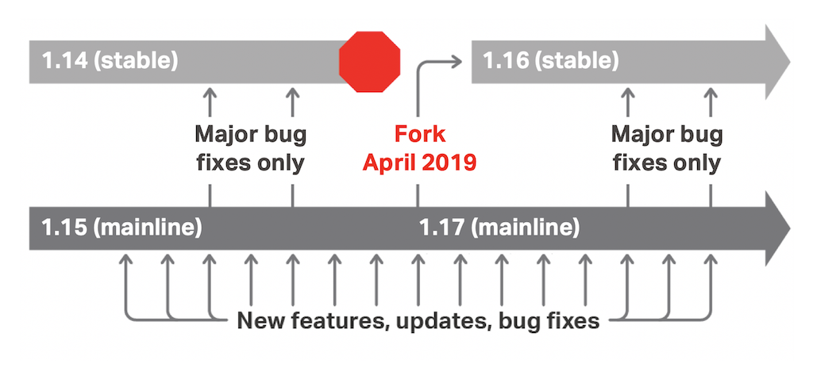

近期Nginx发布了1.17.0主线版本与1.16.0稳定版本，并且发布了一篇文章< Introducing NGINX 1.16 and 1.17 >说明Nginx的版本更新策略、推荐分支、1.16.x新增的主要特性、1.17.x的路线规划。

# 【版本策略】

## 分支说明

与Linux内核版本号类似，nginx的版本号也使用奇数偶数区分开发版本（主线版本）与稳定版本。例如1.13.x、1.15.x、1.17.x系列就是开发版本，1.12.x、1.14.x、1.16.x就是稳定版本。

关于主线版本与稳定版本的定义，按官方的说法如下：

- 主线版本就是开发版本，会持续的加入特性与修补bug。
- 稳定版本，只修复有高安全风险的bug。

特别注意，稳定版本与开发版本并不是软件质量上的区别，只是特性更新频率的区别。

## 版本演进

关于版本之间如何演进，请参考以下这张图片：

在每年4月前后nginx的开发会进行一次版本号的推进，发布新的主线版本与稳定版本，例如近期的1.17.0与1.16.0。在这有几点值得注意：

- 版本号推进后，旧的稳定版本将不继续更新，也不继续合入bug修复。
- 主线版本号推进并没有大的特性更新，例如从1.15.12到1.17.0，也是常规特性新增与bug修复，并不会加入大量特性。
- 稳定版本号推进将加入大量主线版本特性，例如从1.14.2到1.16.0，将加入所有1.15.x主线版本开发的所有特性修改。（1.16.0与1.15.12内容相同）
- 主线版本的更新周期，大约是4~6周一次，可以通过订阅http://nginx.org/en/CHANGES，获取更新内容。

# 【如何选择分支】

通过以上版本策略描述，主线版本与稳定版本只存在特性上的不同，对于软件质量要求都是一致的。所以官方的推荐是尽量使用主线版本。

同时Nginx的商业版本（NGINX Plus）也总是基于最近的主线版本，并加入闭源的部分代码，形成商业版本提供服务。

但是由于主线版本的更新周期较快，如果紧跟主线版本有困难，可以选择跟进稳定版本，每年做一次大的更新。

在我个人的工作中，我们团队交付的组件是基于nginx进行大量的二次开发。每月同步主线版本将带来很多工作量。（我们对nginx代码进行了大量调整）所以我们采取了2个活动，保障组件与官方代码的同步，更好地利用开源软件优势。

- 订阅NGINX主线版本更新，关注是否有与我们密切相关的特性修改，选择性同步。
- 每年同步一次稳定版本，防止过大的差异导致失去开源支持。

# 【参考资料】

- < Introducing NGINX 1.16 and 1.17 > https://www.nginx.com/blog/nginx-1-16-1-17-released/
- < NGINX CHANGE>  http://nginx.org/en/CHANGES
- < NGINX-1.16 CHANGE> http://nginx.org/en/CHANGES-1.16

